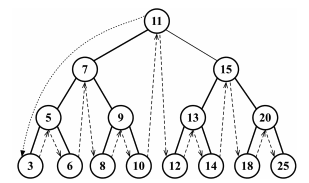

### In-Order Traversal
> An in-order traversal will **visit all nodes in ascending order, starting from a given node (optional)**, and perform the given callback function (also optional)


```
Inorder => Left, Root, Right.
Step 1 − Recursively traverse left subtree.
Step 2 − Visit root node.
Step 3 − Recursively traverse right subtree.
```
```js
inOrderTraverse(node, callback) {
    if(node != null) {
        this.inOrderTraverse(node.left, callback);
        callback(node.data);      //execuate function on each node in order => left, root, right
        this.inOrderTraverse(node.right, callback);
    }
}
```
eg:
```java
// Recursive function to perform inorder traversal on the tree
public static void inorder(Node root){
		// return if the current node is empty
		if (root == null) {
			return;
		}
	
		// Traverse the left subtree
		inorder(root.left);
	
		// Display the data part of the root (or current node)
		System.out.print(root.data + " ");
	
		// Traverse the right subtree
		inorder(root.right);
}
/* 
example:
			       1
			     /   \
		            /     \
			   2       3
			  /      /   \
			 /      /     \
			4      5       6
                              / \
			     /   \
			    7     8
         
          output: 4 2 1 7 5 8 3 6        
*/


```

### Pre-Order Traversal
> A pre-order traversal **visits the node prior to its descendants**.


```
Preorder => Root, Left, Right.
Step 1 − Visit root node.
Step 2 − Recursively traverse left subtree.
Step 3 − Recursively traverse right subtree.
```
```js
preOrderTraverse(node, callback) {
    if(node != null) {
        callback(node.data);		 //execuate function on each node in preorder => root, left, right
        this.preOrderTraverse(node.left, callback);
        this.preOrderTraverse(node.right, callback);
    }
}
```
```java
 // Recursive function to perform preorder traversal on the tree
 public static void preorder(Node root) {
        // return if the current node is empty
        if (root == null) {
            return;
        }
    
        // Display the data part of the root (or current node)
        System.out.print(root.data + " ");
    
        // Traverse the left subtree
        preorder(root.left);
    
        // Traverse the right subtree
        preorder(root.right);
}

/*
     
                   1
                 /   \
                /     \
               2       3
              /      /   \
             /      /     \
            4      5       6
                  / \
                 /   \
                7     8
        output: 1 2 4 3 5 7 8 6 
*/
```

### Post-Order Traversal
> A post-order traversal **visits the node after its descendants**.


```
Post order => Left, Right, Root.
Step 1 − Recursively traverse left subtree.
Step 2 − Recursively traverse right subtree.
Step 3 − Visit root node.
```
```js
postOrderTraverse(node, callback) {
    if(node != null) {
        this.postOrderTraverse(node.left, callback);
        this.postOrderTraverse(node.right, callback);
        callback(node.data);		//execuate function on each node in post order => left, right, root
    }
}
```
```java
// Recursive function to perform postorder traversal on the tree
public static void postorder(Node root) {
        // return if the current node is empty
        if (root == null) {
            return;
        }
    
        // Traverse the left subtree
        postorder(root.left);
    
        // Traverse the right subtree
        postorder(root.right);
    
        // Display the data part of the root (or current node)
        System.out.print(root.data + " ");
}

/* 

                   1
                 /   \
                /     \
               2       3
              /      /   \
             /      /     \
            4      5       6
                  / \
                 /   \
                7     8
          output: 4 2 7 8 5 6 3 1 
*/

```


