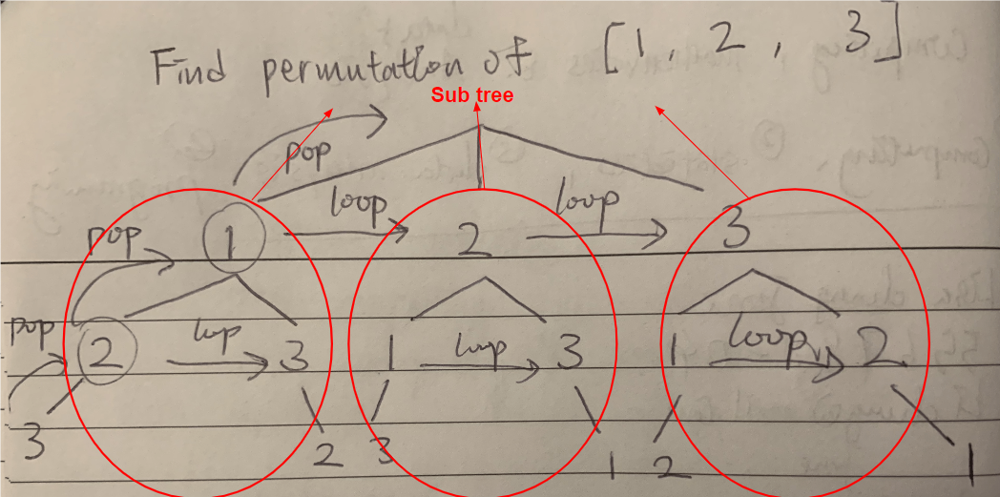

# combination & permutation

> Solve combinations and permutation problem by **backtracking algorithmn**.

**Step**
- 1. Adding a tree node through the iteration proccess
- 2. recursion(backtracking, just repeat all the steps in subtrees)
- 3. remove a tree node before next interation
- 4. if a solution found, add to the solutions set and add **return** keyword to stop that iteration process.

combination:

https://javascript.plainenglish.io/combinations-recursive-backtracking-in-javascript-e784cfb8e73d

permutation:

https://javascript.plainenglish.io/backtracking-iii-permutations-834bfb5bd9d0

